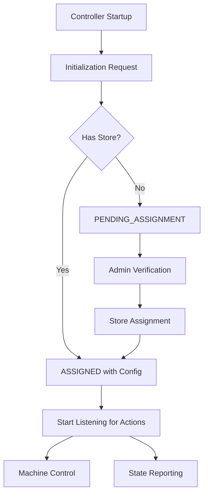

# Laundry Management System (LMS) Documentation

## Overview

This documentation provides comprehensive specifications for the Laundry Management System's MQTT-based communication flows and message schemas. The system enables IoT controllers to communicate with the backend for machine control, state synchronization, and administrative operations.

## System Architecture

The LMS consists of:
- **IoT Controllers**: Physical devices that control washing machines, dryers, and other equipment
- **Backend System**: Central server handling business logic, user management, and data processing
- **Admin Interface**: Web-based interface for store management and controller assignment
- **MQTT Broker**: Message broker facilitating real-time communication between components

## Documentation Structure

### 📋 [Base Schema](./schemas/base.md)
Foundation schema used across all MQTT message flows.

**Key Features:**
- Unified JSON message structure
- Common field definitions and validation rules
- Versioning strategy and backward compatibility
- Security considerations and best practices

### 🔄 Flow Documentation

#### Initialization Flows
**Purpose**: Handle controller startup and store assignment

1. **[MQTT Initialization Flow](./flow/initialization/1.mqtt-initialization-flow.md)**
   - Controller startup and configuration
   - Store assignment verification
   - Topic: `/initialization`

2. **[Wait Admin Assign Store Flow](./flow/initialization/2.wait-admin-assign-store-flow.md)**
   - Admin verification process with LED activation
   - Store assignment workflow
   - Topics: `/controller/<id>/wait_admin_assign_store`, `/controller/<id>/verification`

#### Action Flows
**Purpose**: Control machine operations

3. **[Start Machine Flow](./flow/actions/1.start-machine-flow.md)**
   - User-initiated machine control
   - Washer and dryer start operations
   - Topics: `/stores/<store_id>/controllers/<controller_id>/actions`, `/stores/<store_id>/controllers/<controller_id>/ack`

#### Metrics Flows
**Purpose**: Synchronize machine state information

4. **[Machine State Sync Flow](./flow/metrics/1.machine-state-sync-flow.md)**
   - Periodic state reporting from controllers
   - Real-time machine status updates
   - Topic: `/stores/<store_id>/controllers/<controller_id>/metrics`

## Quick Start Guide

### For Developers

1. **Start with the Base Schema**: Read [base.md](./schemas/base.md) to understand the common message structure
2. **Choose Your Flow**: Navigate to the relevant flow document based on your implementation needs
3. **Follow the Examples**: Each flow document includes complete JSON examples
4. **Implement Validation**: Use the provided schemas for message validation

### For System Administrators

1. **Understand the Flows**: Review initialization and assignment flows for controller setup
2. **Monitor State**: Use metrics flow documentation for system monitoring
3. **Troubleshoot Issues**: Reference error handling sections in each flow document

## Message Flow Overview

## Key Concepts

### Message Structure
All messages follow the base schema with these common fields:
- `version`: Schema version for compatibility
- `event_type`: Specific action or event type
- `timestamp`: UTC+7 timestamp
- `correlation_id`: UUID for message tracking
- `controller_id`: Unique controller identifier
- `store_id`: Store assignment (null if unassigned)
- `payload`: Event-specific data

### Machine Types
- **Washer**: Washing machine equipment
- **Dryer**: Drying machine equipment
- **Future**: Detergent dispensers and other equipment

### Machine States
- **idle**: Machine is available and not in use
- **busy**: Machine is currently operating

### Controller States
- **PENDING_ASSIGNMENT**: Waiting for store assignment
- **ASSIGNED**: Successfully assigned to a store and operational

## MQTT Topic Structure

### Global Topics
- `/initialization` - Controller initialization requests

### Controller-Specific Topics
- `/controller/<controller_id>/wait_admin_assign_store` - Store assignment
- `/controller/<controller_id>/verification` - Admin verification

### Store-Specific Topics
- `/stores/<store_id>/controllers/<controller_id>/actions` - Machine control
- `/stores/<store_id>/controllers/<controller_id>/ack` - Acknowledgments
- `/stores/<store_id>/controllers/<controller_id>/metrics` - State reporting

## Implementation Guidelines

### Message Validation
- Always validate messages against the provided schemas
- Check required fields and data types
- Handle null values appropriately

### Error Handling
- Implement retry logic for failed transmissions
- Log errors for debugging and monitoring
- Provide meaningful error messages

### Security
- Validate controller and store IDs
- Implement proper access controls
- Consider message authentication for production

### Performance
- Use appropriate message frequencies
- Implement message queuing for reliability
- Monitor system load and adjust accordingly

## Version Information

- **Documentation Version**: 1.0.0
- **Base Schema Version**: 1.0.0
- **Last Updated**: January 2024

## Contributing

When updating this documentation:
1. Maintain backward compatibility
2. Update version numbers appropriately
3. Include comprehensive examples
4. Test all message schemas
5. Update this README if adding new flows

## Support

For questions or issues:
1. Check the relevant flow documentation
2. Review the base schema for common patterns
3. Examine the provided examples
4. Contact the development team for clarification

---

*This documentation serves as the authoritative source for LMS MQTT communication protocols and should be referenced for all system implementations.*